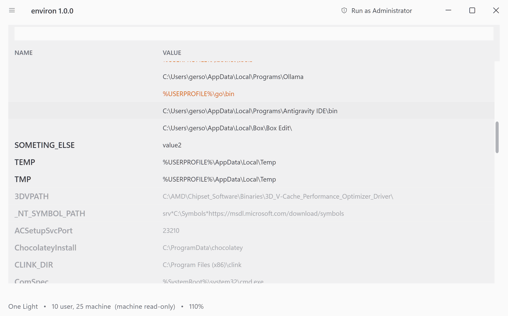
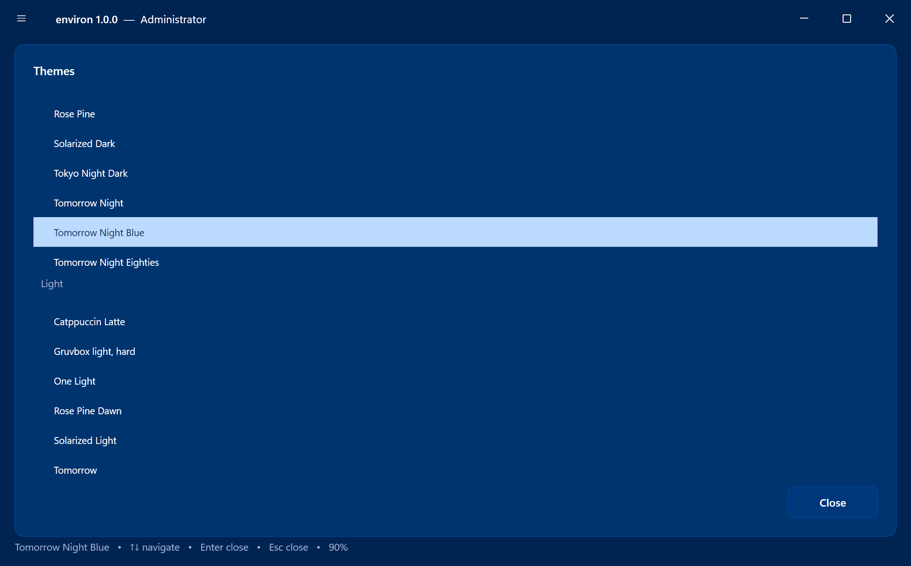
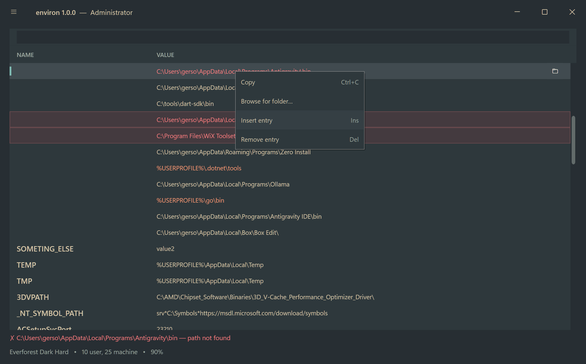

# Environ

> *L'éditeur des variables d'environnement. For English speakers, mostly.*

A modern environment-variable editor for Windows 11 — the one Microsoft forgot to ship.

**License:** MIT

---

## Why this exists

You know the dialog. Two nested pop-ups deep, a list box four lines tall, and `PATH`
crammed into a single text field as a 4,000-character semicolon casserole. It has not
meaningfully changed since Windows 95 wore short trousers.

Environ replaces it. Spiritual successor to RapidEE, reimagined for 2026: everything the
built-in dialog does, done properly, in a fast native Windows 11 app that looks like it
belongs on the operating system it runs on.

## Features

- **One grid, both worlds.** Your variables (per-user) and the machine's, side by side in
  an editable, Excel-style grid. Edit names and values in place.
- **`PATH`, finally legible.** Path-style variables are split into **one row per entry** —
  add, remove, and reorder them with the keyboard (`Insert`, `Delete`, `Alt+↑/↓`). No more
  surgery on a semicolon soup.
- **It tells you what's wrong.** Folders that don't exist are flagged in **red**; duplicate
  entries are called out. `%VARIABLES%` are expanded so you see where things *actually* point.
- **Browse, don't type.** Pick a folder or file from a dialog instead of pasting a path —
  and it's polite about it: if your value was `%USERPROFILE%\go`, picking a subfolder keeps
  the `%USERPROFILE%` prefix instead of flattening it to `C:\Users\you\...`.
- **It knows things.** Built-in descriptions for ~90 common variables (`JAVA_HOME`,
  `GOPATH`, `TEMP`, …) appear in the detail strip, so you're not guessing what `_NT_SYMBOL_PATH` does.
- **Nothing happens until you say so.** Edits are staged. A **dry-run review** shows exactly
  what will change before a single byte hits the registry — and it notices if something
  changed underneath you in the meantime.
- **An undo button for your entire environment.** Every save is snapshotted to a local
  history. Browse it, diff any two states, and **restore** — because "what did I do to PATH
  last Tuesday?" deserves an answer.
- **Search.** Type to filter. That's it. That's the feature.
- **Take it with you.** Export your whole environment to a TOML file and import it on another
  machine (or after the inevitable reinstall).

## Themes

Twenty built-in Base16 color schemes — Catppuccin, Gruvbox, Nord, Solarized, Tokyo Night,
the Tomorrow family (including the gloriously blue *Tomorrow Night Blue*) and friends —
grouped by light and dark, switched live. Fancy something else? Drop any Base16 `.yaml`
into the `themes` folder and it shows up. Fonts, zoom (`Ctrl`+mouse-wheel), and horizontal
scrolling for the truly cursed `PATH` are all adjustable.

## Machine variables & "Run as Administrator"

Environ starts **unelevated**, so your own variables are fully editable while the machine's
stay safely read-only. Need to touch a system variable? One click on **Run as Administrator**
relaunches with a UAC prompt — and the title bar grows a tasteful "— Administrator" so you
remember you're playing with the big-kid settings.

## Install

Grab the installer from the [Releases](https://github.com/gersonkurz/environ/releases) page.
It's a single bootstrapper that picks the right build for your machine (**x64 or ARM64**),
optionally adds environ to your `PATH`, and offers to launch it when it's done.

No .NET, no Electron, no runtime to chase down — just one small native executable that's
open before you've finished letting go of the mouse button.

## License

MIT. Do what you like; don't blame us if you set `PATH` to something silly.
